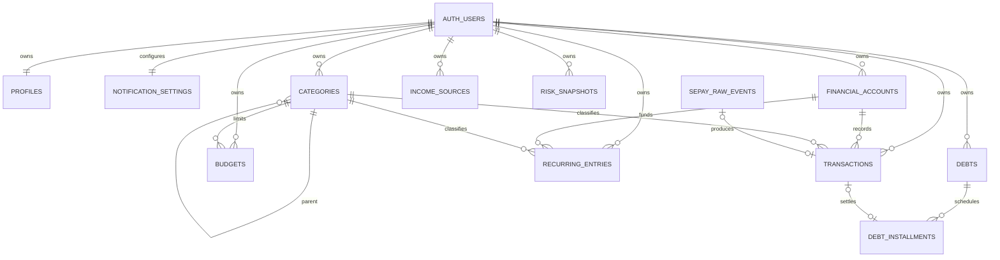

# Database Supabase

## Quan hệ

Mọi số tiền dùng `BIGINT`; tỷ lệ/lãi suất dùng `NUMERIC`. `timestamptz` được lưu UTC bởi PostgreSQL và client chịu trách nhiệm hiển thị theo `Asia/Ho_Chi_Minh`.

## Số dư và idempotency

Trigger `transactions_balance_after_change` áp dụng delta cho insert/update/delete và chỉ tính giao dịch `confirmed`. Chuyển khoản tạo hai leg cùng `transfer_group_id`, một `out` và một `in`, trong một RPC/transaction có khóa hai account theo UUID để tránh deadlock.

SePay có hai lớp chống trùng: unique `sepay_event_id`/`(event_type,payload_hash)` ở raw event và unique partial `transactions.raw_event_id`. Android không có grant hay RLS policy trên raw events.

## Rollback

Baseline này dành cho database chưa có dữ liệu. Rollback local an toàn bằng `supabase db reset` sau khi bỏ/đổi tên migration. Với môi trường đã có dữ liệu, không drop trực tiếp: tạo migration forward mới, export backup trước, gỡ trigger/policy/function rồi migrate dữ liệu sang schema thay thế. Supabase CLI không tự động chạy down migration.
